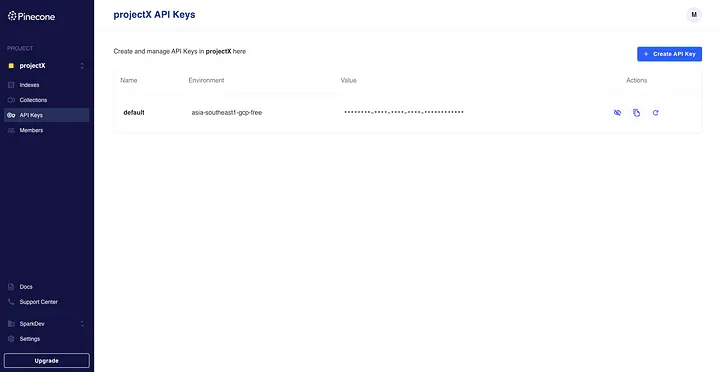

# Using Pinecone Vector Database

Pinecone is not a traditional database, but rather a cloud-native vector database specifically designed for similarity search and recommendation systems. It provides a highly efficient and scalable solution for storing and querying high-dimensional vector data.

## Introduction:

In similarity search applications, data points are represented as vectors, where each dimension of the vector corresponds to a feature or attribute. Pinecone’s primary goal is to enable fast and accurate similarity searches across vast amounts of vector data.

Pinecone leverages advanced indexing and search algorithms to optimize the performance of similarity search queries. It uses an indexing technique called Approximate Nearest Neighbor (ANN) search, which allows for efficient retrieval of vectors that are similar or closest to a given query vector. By using approximate methods, Pinecone can achieve low-latency search operations even with extremely large datasets.

One of the key advantages of Pinecone is its scalability. It can handle massive amounts of vector data and support real-time updates, making it suitable for high-velocity data streams. It can seamlessly scale horizontally by distributing data and search operations across multiple nodes, ensuring both high throughput and low latency.

Pinecone also provides a user-friendly API that simplifies the integration and usage of the database in applications. It has got the API for all major languages like Python, Javascript, NodeJS etc

## Implementation:

Create python virtual environment :

```bash
pip install virtualenv

python<version> -m venv <virtual-environment-name>
```

Example :

```bash
 mkdir project_name
 cd project_name
 python -m venv venv
```

Activate the Virtual Environment :

```bash
 env/Scripts/activate.bat //In CMD
 env/Scripts/Activate.ps1 //In Powershel
```

Install required packages from attached requirements.txt

```bash
 pip install -r requirements.txt
```

The first step in starting this implementation would be creating an account in pinecone and setting a project in pinecone using their console called pinecone console.


after the project setup, select that project and navigate to the API Keys in the left navigation to get the environment & api key as shown below.



navigate to the location where main.py is present and run the below command.

```bash
uvicorn main:app --reload
```

if everything goes well then you should see the below log in the console of your terminal window.


once the application is running, launch the browser and hit the below

http://127.0.0.1:8000/docs#/

Now we are ready to do some operations on pinecone by using our swagger and once you save some data to database and go to pinecone console and navigate to indexes menu in left navigation this is how it should look like. in my case i create 9 vectors some with namespace and some without namespace.

## Conclusion:

In summary, using a Pinecone vector database offers several advantages. It enables efficient and accurate retrieval of similar vectors, making it suitable for recommendation systems, anomaly detection, and search engines. Pinecone can handle large-scale datasets, ensuring real-time search capabilities even with massive data volumes. Its flexibility in handling diverse vector types allows businesses to leverage various data formats. Pinecone provides a developer-friendly experience with an easy-to-use API and integration options. With Pinecone, businesses can unlock the potential of their data, extract valuable insights, and deliver personalized user experiences.
